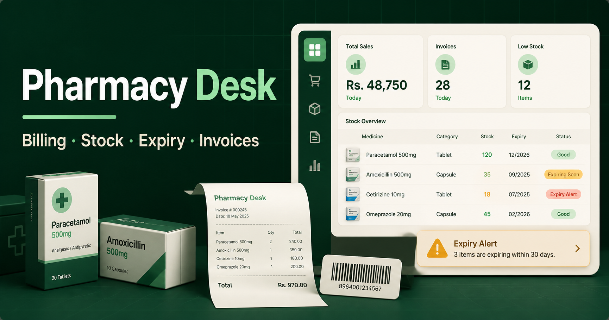

# Pharmacy Desk

A simple, bilingual pharmacy billing and inventory demo designed for local pharmacies in Pakistan. The interface prioritizes fast counter work, batch traceability, expiry safety, and understandable owner reports.



## Core workflows

- Fast medicine and barcode search
- Counter cart with quantity, discount, payment, and printable invoice
- Automatic stock deduction after a completed sale
- Purchase receiving with automatic stock increase
- Batch and expiry tracking
- Near-expiry and low-stock alerts
- Immutable-style stock movement history
- Sales, estimated profit, and stock-value reports
- English and Urdu interface with responsive RTL layout

## Technology

- React 19
- Vite 8
- Lucide icons
- Plain responsive CSS
- Node's built-in test runner
- Vercel deployment configuration

## Local development

```bash
npm install
npm run dev
```

Run the full quality gate:

```bash
npm run check
```

## Repository structure

```text
src/
  data/seed.js          realistic demo data
  lib/pharmacy.js       tested business rules
  main.jsx              application UI and workflows
  styles.css            responsive visual system
test/
  pharmacy.test.js      sale, stock, and purchase tests
.github/workflows/
  ci.yml                automated test and build checks
```

## Data and production roadmap

This repository is a sales demonstration. Business records are currently stored in the browser on the current device. A production rollout should replace that storage with a secure database and add authentication, role permissions, automated backups, audit logs, and pharmacy-specific compliance review.

## Safety

Pharmacy Desk manages business records; it does not provide medical advice, diagnose conditions, or validate prescriptions. Production use requires appropriate operational and legal review.

## Deployment

The project is configured for Vercel. Import the repository or run:

```bash
vercel --prod
```

## License

Copyright © 2026. All rights reserved.
